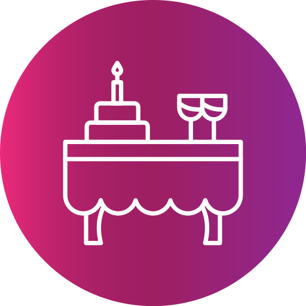
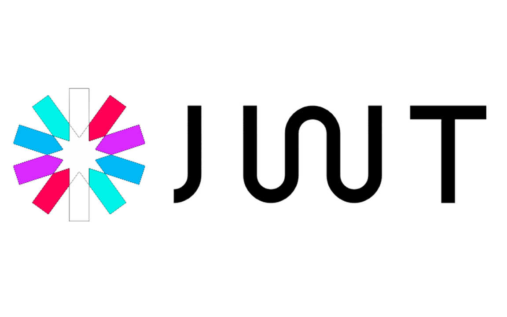

<!-- PROJECT LOGO -->
 

  

  <h3 align="center">Catering system API</h3>

  

     
    <a href="https://github.com/AndreiMiron-hub/Internship_Catering_Backend"><strong>Explore the project »</strong></a>
     
  

<!-- TABLE OF CONTENTS -->

  
Table of Contents

  <ol>
    <li>
      <a href="#about-the-project">About The Project</a>
      <ul>
        <li><a href="#built-with">Built With</a></li>
      </ul>
    </li>
    <li><a href="#roadmap">Roadmap</a></li>
    <li><a href="#contact">Contact</a></li>
    <li><a href="#acknowledgments">Acknowledgments</a></li>
  </ol>

## About The Project

- The RESTful API was developed by reverse engineering an existing web application without access to the original source code, with the purpose of replicating the functionality of the original application.
- The version control for the API was managed on a BitBucket repository. The pull requests were reviewed and approved by a supervisor.
- The project includes a basic implementation of unit tests although the code was not written tests first.
- The database was designed by first creating its visual diagram in a third party application and only after that using a code-fist approach was it implemented.
- Manual tests were conducted via Swagger and Postman, tools which were also used to document the API.
- The unit testing was conducted using

(<a href="#readme-top">back to top</a>)

### Built With

<ol>
<ul align="row">
     
    ASP.NET on .NET 6 
</ul>
<ul align="row">
    
    BitBucket
</ul>
<ul>
    
    Moq and xUnit
</ul>
<ul>
    
    Lucidchart
</ul>
<ul>
    
    EntityFramework
</ul>
<ul>
    
    SQL Server
</ul>
<ul>
    
    SQL Server ManagementStudio (SSMS).
</ul>
<ul>
    
    Swagger 
</ul>
<ul>
    
    Postman
</ul>
<ul>
    
    JWT
</ul>
</ol>

(<a href="#readme-top">back to top</a>)

<!-- ROADMAP -->

## Roadmap

- [x] Create database
- [x] Create entities
- [x] Create repositories for each entity
- [x] Implement code standardisation using Roslynator
- [x] Create necessary DTOs
- [x] Create services for each entity
- [x] Create controllers for each entity
- [x] Implement login and security features for controllers
- [x] Setup CORS policy
- [x] Validate data consumed by the API
- [x] Implement error handler middleware
- [x] Create unit tests

(<a href="#readme-top">back to top</a>)

## Contact

Miron Andrei - [LinkedIn](www.linkedin.com/in/andrei-miron-a51236245) - andreimiron001@gmail.com

Project Link: [https://github.com/AndreiMiron-hub/Internship_Catering_Backend](https://github.com/AndreiMiron-hub/Internship_Catering_Backend)

(<a href="#readme-top">back to top</a>)

## Acknowledgments

- [EntityFramework](https://learn.microsoft.com/en-us/ef/)
- [AutoMapper](https://docs.automapper.org/en/stable/)
- [xUnit](https://xunit.net/#documentation)
- [JWT](https://jwt.io/introduction)

(<a href="#readme-top">back to top</a>)

